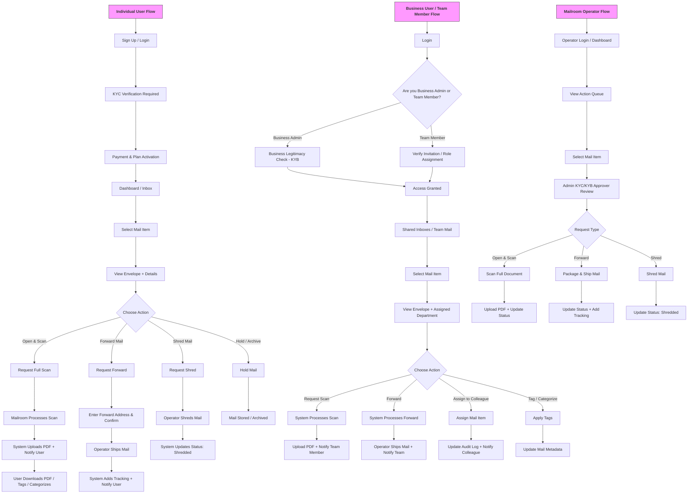

```mermaid
flowchart TD
    %% Individual User Flow Title
    T1[Individual User Flow]:::title
    T1 --> A0[Sign Up / Login]
    A0 --> A1[KYC Verification Required]
    A1 --> A2[Payment & Plan Activation]
    A2 --> A[Dashboard / Inbox]

    A --> B[Select Mail Item]
    B --> C[View Envelope + Details]
    C --> D{Choose Action}
    D -->|Open & Scan| E[Request Full Scan]
    D -->|Forward Mail| F[Request Forward]
    D -->|Shred Mail| G[Request Shred]
    D -->|Hold / Archive| H[Hold Mail]

    E --> I[Mailroom Processes Scan]
    I --> J[System Uploads PDF + Notify User]
    J --> K[User Downloads PDF / Tags / Categorizes]

    F --> L[Enter Forward Address & Confirm]
    L --> M[Operator Ships Mail]
    M --> N[System Adds Tracking + Notify User]

    G --> O[Operator Shreds Mail]
    O --> P[System Updates Status: Shredded]

    H --> Q[Mail Stored / Archived]


    %% Business User Flow Title
    T2[Business User / Team Member Flow]:::title
    T2 --> A0b[Login]
    A0b --> A1b{Are you Business Admin or Team Member?}

    %% Admin path
    A1b -->|Business Admin| KYBb[Business Legitimacy Check - KYB]
    KYBb --> A2b[Access Granted]

    %% Team Member path
    A1b -->|Team Member| INVb[Verify Invitation / Role Assignment]
    INVb --> A2b

    %% Main shared business workflow
    A2b --> B2[Shared Inboxes / Team Mail]
    B2 --> C2[Select Mail Item]
    C2 --> D2[View Envelope + Assigned Department]
    D2 --> E2{Choose Action}

    E2 -->|Request Scan| F2[System Processes Scan]
    E2 -->|Forward| G2[System Processes Forward]
    E2 -->|Assign to Colleague| H2[Assign Mail Item]
    E2 -->|Tag / Categorize| I2[Apply Tags]

    F2 --> J2[Upload PDF + Notify Team Member]
    G2 --> K2[Operator Ships Mail + Notify Team]
    H2 --> L2[Update Audit Log + Notify Colleague]
    I2 --> M2[Update Mail Metadata]


    %% Mailroom Operator Flow Title
    T3[Mailroom Operator Flow]:::title
    T3 --> A3[Operator Login / Dashboard]
    A3 --> B3[View Action Queue]
    B3 --> C3[Select Mail Item]

    %% Admin KYC/KYB Approval Step
    C3 --> KYC_Approval[Admin KYC/KYB Approver Review]
    KYC_Approval --> D3{Request Type}

    D3 -->|Open & Scan| E3[Scan Full Document]
    D3 -->|Forward| F3[Package & Ship Mail]
    D3 -->|Shred| G3[Shred Mail]

    E3 --> H3[Upload PDF + Update Status]
    F3 --> I3[Update Status + Add Tracking]
    G3 --> J3[Update Status: Shredded]

    %% Styling for Titles
    classDef title fill:#f9f,stroke:#333,stroke-width:1px,font-weight:bold

```
